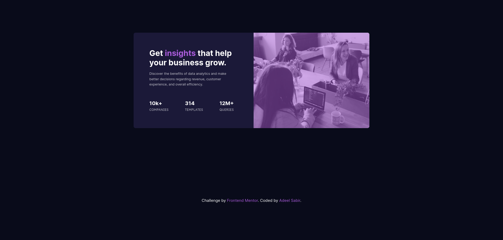

# Frontend Mentor - Stats preview card component solution

This is a solution to the [Stats preview card component challenge on Frontend Mentor](https://www.frontendmentor.io/challenges/stats-preview-card-component-8JqbgoU62). Frontend Mentor challenges help you improve your coding skills by building realistic projects.

## Table of contents

- [Overview](#overview)
  - [The challenge](#the-challenge)
  - [Screenshot](#screenshot)
  - [Links](#links)
- [My process](#my-process)
  - [Built with](#built-with)
  - [What I learned](#what-i-learned)
  - [Continued development](#continued-development)
  - [Useful resources](#useful-resources)
- [Author](#author)
- [Acknowledgments](#acknowledgments)

**Note: Delete this note and update the table of contents based on what sections you keep.**

## Overview

This is a small exercise to build a responsive card component. The objective is to make the layout look as close as possible to the original template, on both the desktop and mobile devices. It is a beginner's exercise so only HTML and CSS are recommended.

### The challenge

Users should be able to:

- View the optimal layout depending on their device's screen size

### Screenshot

### Links

- Solution URL: [GitHub Repo](https://github.com/asab07/responsive-stats-card-1)
- Live Site URL: [GitHub Repo](https://asab07.github.io/responsive-stats-card-1/)

## My process

**1. Plan:** I started out by looked at some card examples built in plain CSS, without using any frameworks.

**2. Design:** The design phase did take much time since the design basis and the assets were already available through the solution template.

**3. Development:** I built the card using HTML and CSS. I used SASS to facilitate the workflow and get some practice in it. I tested the website on Google Chrome and Firefox at different viewports.

### Built with

- Semantic HTML5 markup
- CSS custom properties
- Flexbox
- SASS
- Mobile-first workflow

### What I learned

I spent a lot of time initially to make the mobile version as close as possible to the provided template. This meant fine-tuning the element margins, paddings, font sizes, as well as choice of scales.

_The lesson learnt_: try and make the design look close to the template, but not necessarily identical. It would have saved me some time, and the fine tuning could have been done at the end.

Another mistake I made, that cost me some additional time, was to try and accomplish this in as few lines of code as possible, especially in the CSS. For instance, I had originally intended to do it without using media queries, and there are some clever solutions out there, such as [Media Query-less Responsive Card Component](https://css-tricks.com/how-to-make-a-media-query-less-card-component/). However, is best to keep things simple when you are starting out, and especially for simple projects.

_The lesson learnt_: use textbook knowledge unless you have a reason not to, especially in the beginning.

### Continued development

The two main ways I'd like to redo this project are:

- Without using any media queries
- Using grid instead of flex-box

### Useful resources

- [Kevin Powell's Responsive CSS Card Design](https://www.youtube.com/watch?v=51DbAwcmqD8&t=625s) - Kevin's video helped me understand the mobile-first workflow and design a responsive card. I really liked teaching style and explanations and would recommend his channel to others.
- [CSS Flexbox Guide](https://css-tricks.com/snippets/css/a-guide-to-flexbox/) - This is a great guide to understanding CSS Flexbox - an amazing article with visual aids and examples. I'd recommend it to anyone still learning this concept.

## Author

- Website - [Adeel Sabir](https://github.com/asab07)
- Frontend Mentor - [@asab07](https://www.frontendmentor.io/profile/asab07)

## Acknowledgments

I would like to thank the team and Frontendmentor.io for sharing their knowledge and providing an excellent platform to new learners.
